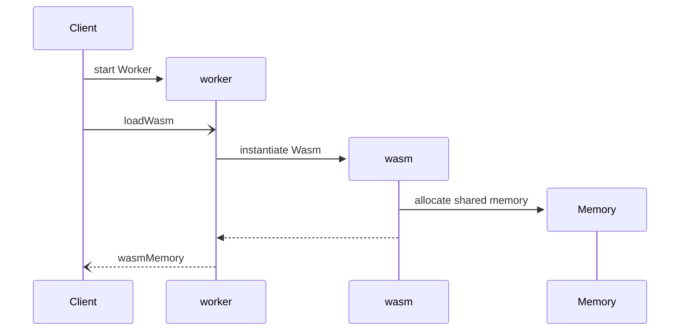
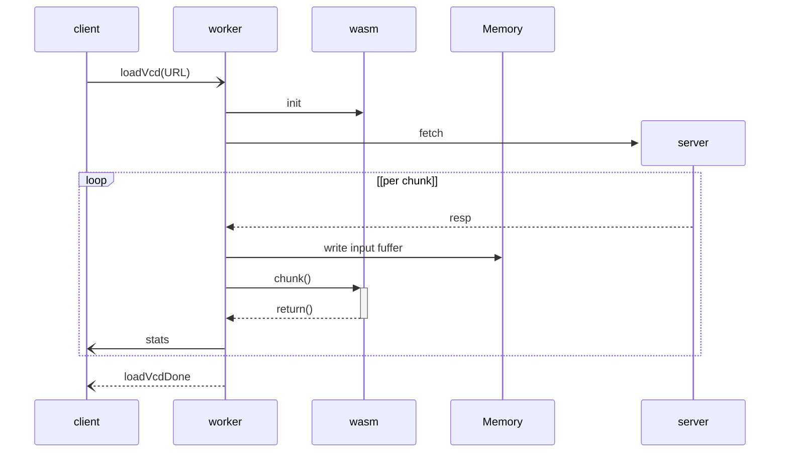

# VCD2 - High-Performance VCD Parser

[](https://www.npmjs.org/package/vcd2)

VCD2 is a high-performance **VCD (Value Change Dump) parser** written in C and compiled to WebAssembly (WASM). It provides efficient streaming parsing of VCD files for both browser and Node.js environments.

## Overview & Features

VCD2 is designed to handle large VCD files efficiently and serves as the foundation for digital waveform visualization tools in the WaveDrom ecosystem. Key capabilities include:

* **High-Performance Parsing**: C-based parser core compiled to WebAssembly for near-native speed
* **Streaming Architecture**: Process files larger than available memory without blocking
* **Cross-Platform Compatibility**: Works seamlessly in both Browser and Node.js environments
* **Memory Efficient Design**: Uses shared memory model and optimized page-based data structures
* **Complete VCD Support**: Handles all standard VCD commands and value types plus VHDL states and nonstandard extensions from popular simulators. Supports large list of simulators in https://github.com/wavedrom/vcd-samples repository.
* **Web Worker Ready**: Includes web worker implementation for non-blocking background parsing
* **Optimized Data Access**: Polynomial rolling hash tables for O(1) signal ID lookups
* **Zero-Copy Operations**: Direct memory access between WASM and JavaScript, main application and web worker for maximum efficiency

## Architecture

### Core Components

#### 1. C Parser Core (`vcd_parser.c`, `vcd_wasm.c`)
The heart of VCD2 is a state machine parser generated using the `llparse` library:

- **Grammar Definition**: VCD syntax defined in `build/vcd-llparse.js`
- **State Machine**: Efficient parsing of VCD commands and value changes
- **Memory Management**: Custom page-based allocation for signal data and GL shader data
- **Hash Tables**: Polynomial rolling hash for fast signal ID lookups

#### 2. WebAssembly Interface (`vcd2.wasm`, `vcd2.wasm.js`)
The C parser is compiled to WebAssembly, wrapped into base64 encoded string providing:

- **Shared Memory**: Direct access to parser state from JavaScript using SharedArrayBuffer
- **Callback System**: Event-driven architecture for parsing events
- **Type Safety**: Structured memory layout with typed array views

#### 3. JavaScript Library (`index.js`, `lib/`)
JavaScript wrapper providing:

- **WASM Loading**: Module instantiation and memory setup
- **Command Handling**: Processing of VCD header and scope commands
- **Worker Support**: Web worker implementation for background parsing
- **Memory Views**: Typed array interfaces to WASM memory

### Data Flow

```
VCD File → Streaming Reader → C Parser (WASM) → JavaScript Handlers → Application
```

1. **Input**: VCD data is streamed in chunks to the WASM parser
2. **Parsing**: C state machine processes VCD syntax and extracts events
3. **Callbacks**: Parser invokes JavaScript callbacks for commands and value changes
4. **Storage**: Signal data is stored in optimized page-based structures
5. **Access**: JavaScript can access parsed data through memory views

### Memory Layout

The parser uses a structured memory layout optimized for performance:

```
0x0000000  - Parser Context (64KB)
0x0010000  - Input Buffer (64MB)
0x4010000  - Definitions Hash Table
...        - Trigger Tables
...        - Output Index
...        - Signal Data Pages (64KB each)
...        - GL Shader Data Pages (64KB each)
```

### Key Data Structures

#### GL Storage Pages

```c
struct gl_page_s {
  uint64_t time_start, time_end;
  int32_t id;
  size_t length;
  gl_page_t *next, *prev;
  gl_page_point_t points[POINTS_PER_PAGE];
};
```

#### Signal Data Pages

```c
struct data_page_s {
  uint64_t time_start, time_end;
  int32_t id;
  size_t length;
  data_page_t *next, *prev;
  uint8_t data[DATA_PAGE_SIZE];
};
```

#### Hash Table for Signal IDs
Uses polynomial rolling hash for O(1) signal lookup by VCD identifier.

## Usage

### Basic Example

```javascript
const vcd2 = require('vcd2');

// Initialize parser state
const state = vcd2.initVcdWorkerState();

// Load WASM module
const wasmInstance = await vcd2.loadWasm(state, vcd2.vcd2wasm);

// Parse VCD data
const result = vcd2.chunk(state, vcdData, vcdDataEnd);
```

### Web Worker Example

### Initialization



```javascript
// Main Client thread
const worker = new Worker(vcd2.vcd2worker);
worker.postMessage({cmd: 'loadWasm'});
// receive 'wasmMemory' message

// Worker thread
const vcd2 = require('vcd2');
const wasmInstance = (await loadWasm($, vcd2.vcd2wasm)).instance;
postMessage({cmd: 'wasmMemory', data: wasmInstance.exports.memory});
```

### loadVcd



```javascript
// Main Client thread
worker.postMessage({cmd: 'loadVcd', data: 'example.vcd'});
// receive 'enddefinitions' message
// receive 'stats' messages
// receive 'loadVcdDone' message

// Worker thread
// receive 'loadVcd' message
const $ = initVcdWorkerState();
fetch(dataFileName, ...);
// loop
  // rceive 'fetch' responses
  // ... write to input buffer
  chunk($, inp, oup); // process each chunk
  postMessage({cmd: 'stats', data: {...}}); // per chunk
  postMessage({cmd: 'enddefinitions', data: {...}}); // after $enddefinitions
// end loop
postMessage({cmd: 'loadVcdDone'});
```

## Development

### Building from Source

```bash
npm install
npm run build
```

This will:
1. Generate C parser from grammar using `llparse`
2. Compile C code to WebAssembly using `clang`
3. Convert WASM to base64 encoded string and wrap into JavaScript module using `wasm2js`

### Development Workflow

```bash
npm run watch  # Watch for changes and rebuild
npm test       # Run linting
```

### Testing in Browser

#### Setup CORS Headers

For SharedArrayBuffer support, patch `node_modules/http-server/bin/http-server` at line 166:

```js
options.headers = {
  'Cross-Origin-Opener-Policy': 'same-origin',
  'Cross-Origin-Embedder-Policy': 'require-corp'
};
```

#### Run Test Server

```bash
http-server app -b
```

## VCD Format Support

VCD2 supports the complete VCD specification:

### Declaration Commands
- `$comment` - Comments
- `$date` - Timestamp information
- `$scope` / `$upscope` - Hierarchy definition, all Verilog, SystemVerilog, and VHDL scopes are supported
- `$timescale` - Time unit specification
- `$var` - Signal declarations
- `$version` - Tool version info
- `$enddefinitions` - End of declarations

### Simulation Commands
- `#<time>` - Time stamps
- `0`, `1` - Binary values
- `x`, `X` - Unknown values
- `z`, `Z` - High impedance
- `u`, `U`, `w`, `W`, `l`, `L`, `h`, `H` - VHDL states
- `b<binary>`, `r<real>` - Vector values

## License

[MIT](LICENSE)
